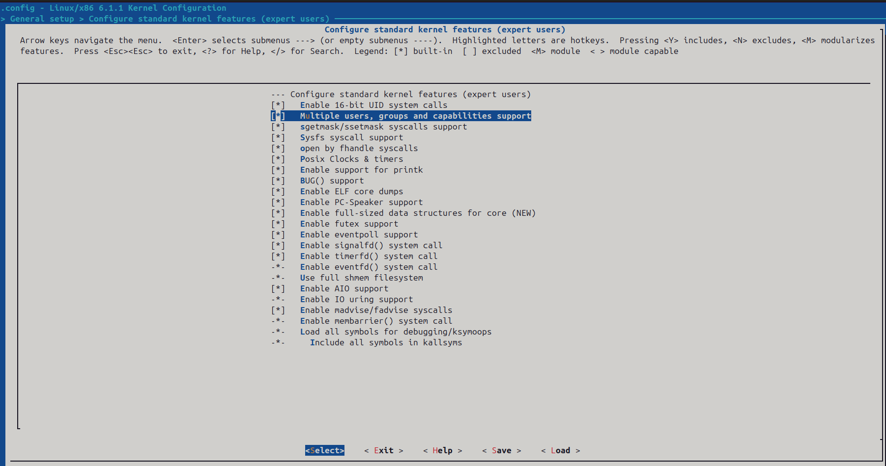
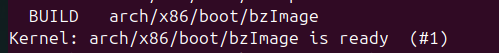
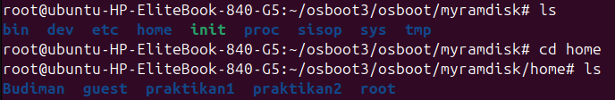
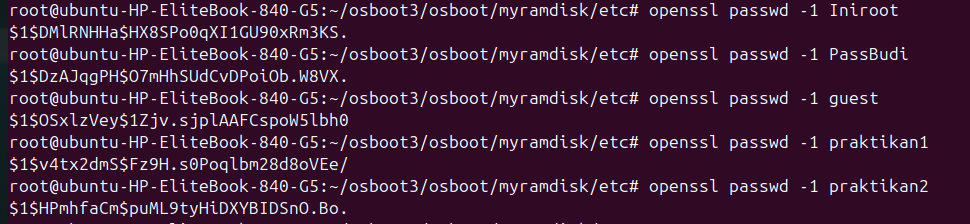
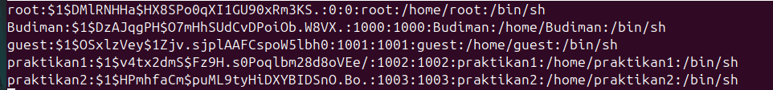
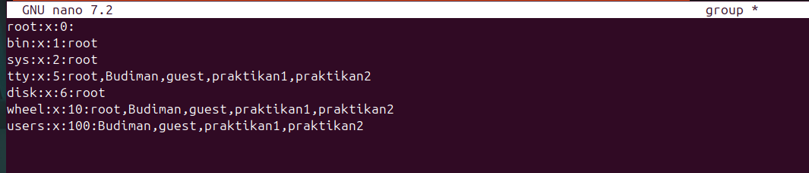
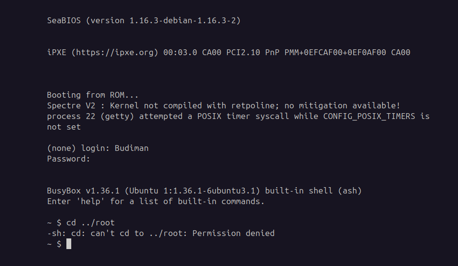

[](https://classroom.github.com/a/Eu-CByJh)
| NRP | Name |
| :--------: | :------------: |
| 5025241054 | Andie Azril Alfrianto |
| 5025241060 | Christina Tan |
| 5025241061 | Ahmad Satrio Arrohman |

# Praktikum Modul 3 _(Module 3 Lab Work)_

### Laporan Resmi Praktikum Modul 3 _(Module 3 Lab Work Report)_

Di suatu pagi hari yang cerah, Budiman salah satu mahasiswa Informatika ditugaskan oleh dosennya untuk membuat suatu sistem operasi sederhana. Akan tetapi karena Budiman memiliki keterbatasan, Ia meminta tolong kepadamu untuk membantunya dalam mengerjakan tugasnya. Bantulah Budiman untuk membuat sistem operasi sederhana!

_One sunny morning, Budiman, an Informatics student, was assigned by his lecturer to create a simple operating system. However, due to Budiman's limitations, he asks for your help to assist him in completing his assignment. Help Budiman create a simple operating system!_

### Soal 1

> Sebelum membuat sistem operasi, Budiman diberitahu dosennya bahwa Ia harus melakukan beberapa tahap terlebih dahulu. Tahap-tahapan yang dimaksud adalah untuk **mempersiapkan seluruh prasyarat** dan **melakukan instalasi-instalasi** sebelum membuat sistem operasi. Lakukan seluruh tahapan prasyarat hingga [perintah ini](https://github.com/arsitektur-jaringan-komputer/Modul-Sisop/blob/master/Modul3/README-ID.md#:~:text=sudo%20apt%20install%20%2Dy%20busybox%2Dstatic) pada modul!

> _Before creating the OS, Budiman was informed by his lecturer that he must complete several steps first. The steps include **preparing all prerequisites** and **installing** before creating the OS. Complete all the prerequisite steps up to [this command](https://github.com/arsitektur-jaringan-komputer/Modul-Sisop/blob/master/Modul3/README-ID.md#:~:text=sudo%20apt%20install%20%2Dy%20busybox%2Dstatic) in the module!_

**Answer:**

- **Code:**

```bash
sudo bash

sudo apt -y update
sudo apt -y install qemu-system build-essential bison flex libelf-dev libssl-dev bc grub-common grub-pc libncurses-dev libssl-dev mtools grub-pc-bin xorriso tmux

mkdir -p osboot3
cd osboot3

mkdir -p osboot
cd osboot

cd osboot3

wget https://cdn.kernel.org/pub/linux/kernel/v6.x/linux-6.1.1.tar.xz
tar -xvf linux-6.1.1.tar.xz
cd linux-6.1.1

make menuconfig

make -j$(nproc)

cd ../osboot

cp ../linux-6.1.1/arch/x86/boot/bzImage ./
```

- **Explanation:**

  Menggunakan sudo bash untuk masuk ke shell bash sebagai superuser atau root. Selanjutnya install dan perbarui software pendukung, tools yang dibutuhkan seperti qemu, build-essential, bison, flex, dan lainnya. Selanjutnya buat direktori osboot dan download kernel linux menggunakan wget dan extract file tersebut. Lalu, make menuconfig dan memilih fitur-fitur yang dibutuhkan, bisa mengikuti konfigurasinya dari modul, lalu tambahkan ```General devices -> Configure standard kernel features -> Multiple users, groups, and capabilities support``` untuk mengaktifkan multi-user. Setelah selesai konfigurasi, jalankan ```make -j$(nproc)``` untuk build kernel. Setelah itu, akan menghasilkan file bzImage. Lalu copy bzImage ke osboot.

- **Screenshot:**

  Centang bagian multiple users

  

  bzImage dicreate dari ```make -j$(nproc)```
  
  

### Soal 2

> Setelah seluruh prasyarat siap, Budiman siap untuk membuat sistem operasinya. Dosen meminta untuk sistem operasi Budiman harus memiliki directory **bin, dev, proc, sys, tmp,** dan **sisop**. Lagi-lagi Budiman meminta bantuanmu. Bantulah Ia dalam membuat directory tersebut!

> _Once all prerequisites are ready, Budiman is ready to create his OS. The lecturer asks that the OS should contain the directories **bin, dev, proc, sys, tmp,** and **sisop**. Help Budiman create these directories!_

**Answer:**

- **Code:**

```bash
cd ~
sudo apt install -y busybox-static

cd osboot3/osboot
mkdir -p myramdisk/{bin,dev,proc,sys,tmp,etc,sisop,home/{root,Budiman,guest,praktikan1,praktikan2}}

cd myramdisk/dev
cp -a /dev/null ./           
cp -a /dev/tty* ./           
cp -a /dev/zero ./           
cp -a /dev/console ./

cp /usr/bin/busybox myramdisk/bin
cd myramdisk/bin
./busybox --install .
```

- **Explanation:**

  Pertama, install busybox. Di dalam busybox tersedia berbagai utilitas sistem yang digunakan untuk mengonfigurasi perangkat keras, memanipulasi sistem berkas, dan melakukan tugas penting lainnya selama proses booting. Setelah itu, buat direktori bin, dev, proc, sys, tmp, etc,dan sisop dalam myramdisk. Direktori /dev di Linux berisi file perangkat penting seperti null, tty, zero, dan console. Kita akan menyalinnya dari sistem host ke dalam direktori dev di myramdisk. Selanjutnya, kita akan menyalin file BusyBox ke direktori bin yang telah dibuat di dalam myramdisk. Kemudian, kita akan menginstal semua utilitas yang disediakan oleh BusyBox.

- **Screenshot:**

   hasil ls dari myramdisk

  

### Soal 3

> Budiman lupa, Ia harus membuat sistem operasi ini dengan sistem **Multi User** sesuai permintaan Dosennya. Ia meminta kembali kepadamu untuk membantunya membuat beberapa user beserta directory tiap usernya dibawah directory `home`. Buat pula password tiap user-usernya dan aplikasikan dalam sistem operasi tersebut!

> _Budiman forgot that he needs to create a **Multi User** system as requested by the lecturer. He asks your help again to create several users and their corresponding home directories under the `home` directory. Also set each user's password and apply them in the OS!_

**Format:** `user:pass`

```
root:Iniroot
Budiman:PassBudi
guest:guest
praktikan1:praktikan1
praktikan2:praktikan2
```

**Answer:**

- **Code:**

```bash

cd myramdisk/etc
touch passwd
touch group

openssl passwd -1 Iniroot
openssl passwd -1 PassBudi
openssl passwd -1 guest
openssl passwd -1 praktikan1
openssl passwd -1 praktikan2

nano passwd
// isi dari passwd //
{
root:$1$DMlRNHHa$HX8SPo0qXI1GU90xRm3KS.:0:0:root:/home/root:/bin/sh
Budiman:$1$DzAJqgPH$O7mHhSUdCvDPoiOb.W8VX.:1000:1000:Budiman:/home/Budiman:/bin/sh
guest:$1$OSxlzVey$1Zjv.sjplAAFCspoW5lbh0:1001:1001:guest:/home/guest:/bin/sh
praktikan1:$1$v4tx2dmS$Fz9H.s0Poqlbm28d8oVEe/:1002:1002:praktikan1:/home/praktikan1:/bin/sh
praktikan2:$1$HPmhfaCm$puML9tyHiDXYBIDSnO.Bo.:1003:1003:praktikan2:/home/praktikan2:/bin/sh
}

cd ..
touch init
nano init

// isi dari init //
{
#!/bin/sh
/bin/mount -t proc none /proc
/bin/mount -t sysfs none /sys

while true
do
    /bin/getty -L tty1 115200 vt100
    sleep 1
done
}

chmod +x init

nano group
// isi dari group //
{
root:x:0:
bin:x:1:root
sys:x:2:root
tty:x:5:root,Budiman,guest,praktikan1,praktikan2
disk:x:6:root
wheel:x:10:root,Budiman,guest,praktikan1,praktikan2
users:x:100:Budiman,guest,praktikan1,praktikan2
}

find . | cpio -oHnewc | gzip > ../myramdisk.gz
```

- **Explanation:**

  Pertama, buat direktori dalam myramdisk dengan format ```/home/(user)```, lalu pindah ke direkori etc dan buat file passwd untuk menyimpan informasi user dan group untuk menyimpan informasi group. Kemudian, gunakan ```openssl passwd -1 (password)``` untuk mendapatkan hash MD5 dari password. Hasilnya nanti akan digunakan sebagai field kedua di file passwd. Lalu, tulis ke file passwd dengan format ```username:password:UID:GID:GECOS:/home/username:/bin/sh```. UID dan GID sama sehingga setiap user memiliki grup yang berisi mereka sendiri. Lalu, buat file init di direktori myramdisk. Script init akan menjadi program pertama yang dijalankan setelah boot. program init didapatkan dari modul sisop. Setelah itu, buat ```chmod +x init``` agar file init bisa dieksekusi. Selanjutnya, buka file group dan salin program ke dalam group. program group didapatkan dari modul sisop, hanya ditambahkan user-usernya saja. ```tty, wheel, dan users``` berisi user biasa agar bisa mengakses terminal atau fitur admin tertentu. Lalu, buat intramfs dengan command ```find . | cpio -oHnewc | gzip > ../myramdisk.gz```

- **Screenshot:**

  hasil generate password

  

   masukkan hasil generate ke passwd

  

  isi dari file group

  


### Soal 4

> Dosen meminta Budiman membuat sistem operasi ini memilki **superuser** layaknya sistem operasi pada umumnya. User root yang sudah kamu buat sebelumnya akan digunakan sebagai superuser dalam sistem operasi milik Budiman. Superuser yang dimaksud adalah user dengan otoritas penuh yang dapat mengakses seluruhnya. Akan tetapi user lain tidak boleh memiliki otoritas yang sama. Dengan begitu user-user selain root tidak boleh mengakses `./root`. Buatlah sehingga tiap user selain superuser tidak dapat mengakses `./root`!

> _The lecturer requests that the OS must have a **superuser** just like other operating systems. The root user created earlier will serve as the superuser in Budiman's OS. The superuser should have full authority to access everything. However, other users should not have the same authority. Therefore, users other than root should not be able to access `./root`. Implement this so that non-superuser accounts cannot access `./root`!_

**Answer:**

- **Code:**

```bash
chmod 644 etc/passwd
chmod 600 etc/group
chown 0:0 home/root
chown 1000:1000 home/Budiman
chown 1001:1001 home/guest
chown 1002:1002 home/praktikan1
chown 1003:1003 home/praktikan2
chmod 700 home/root
```

- **Explanation:**

  ```chmod 644 etc/passwd``` mengatur izin untuk read & write untuk owner, read saja untuk group dan lainnya. ```chmod 600 etc/group``` mengatur izin untuk read & write untuk owner, sedangkan group & lainnya tidak bisa rwx. Lalu, buat ```chown UID:GID home/(user)``` untuk memberikan setiap user hak milik penuh atas home directorinya. Lalu, ```chmod 700 home/root``` untuk memberi owner saja yang bisa rwx, dalam hal ini hanya root sendiri yang mempunyai akses tersebut.

- **Screenshot:**

  Bukti user tidak bisa akses ke root

  

### Soal 5

> Setiap user rencananya akan digunakan oleh satu orang tertentu. **Privasi dan otoritas tiap user** merupakan hal penting. Oleh karena itu, Budiman ingin membuat setiap user hanya bisa mengakses dirinya sendiri dan tidak bisa mengakses user lain. Buatlah sehingga sistem operasi Budiman dalam melakukan hal tersebut!

> _Each user is intended for an individual. **Privacy and authority** for each user are important. Therefore, Budiman wants to ensure that each user can only access their own files and not those of others. Implement this in Budiman's OS!_

**Answer:**

- **Code:**

  ```
  chown 1001:1001 home/Budiman
  chmod 700 home/Budiman
  chown 1002:1002 home/guest
  chmod 700 home/guest
  chown 1003:1003 home/praktikan1
  chmod 700 home/praktikan1
  chown 1004:1004 home/raktikan2
  chmod 700 home/praktikan2
  ```

- **Explanation:**

  Perintah `chown 1001:1001 home/Budiman` menjadikan user dengan UID dan GID 1001 sebagai pemilik dan grup dari direktori `home/Budiman`. Dengan cara yang sama, `chown 1002:1002 home/guest`, `chown 1003:1003 home/praktikan1`, dan `chown 1004:1004 home/praktikan2`. 
  Lalu, perintah `chmod 700` berarti hanya pemilik direktori yang diberikan hak akses penuh (read, write, dan execute), sedangkan grup dan user lain tidak diberi akses.
	
- **Screenshot:**

  

### Soal 6

> Dosen Budiman menginginkan sistem operasi yang **stylish**. Budiman memiliki ide untuk membuat sistem operasinya menjadi stylish. Ia meminta kamu untuk menambahkan tampilan sebuah banner yang ditampilkan setelah suatu user login ke dalam sistem operasi Budiman. Banner yang diinginkan Budiman adalah tulisan `"Welcome to OS'25"` dalam bentuk **ASCII Art**. Buatkanlah banner tersebut supaya Budiman senang! (Hint: gunakan text to ASCII Art Generator)

> _Budiman wants a **stylish** operating system. Budiman has an idea to make his OS stylish. He asks you to add a banner that appears after a user logs in. The banner should say `"Welcome to OS'25"` in **ASCII Art**. Use a text to ASCII Art generator to make Budiman happy!_ (Hint: use a text to ASCII Art generator)

**Answer:**

- **Code:**

  ```
  #!/bin/sh

  /bin/echo -e "\033[38;2;15;124;153m
   /$$      /$$           /$$
  | $$  /$ | $$          | $$
  | $$ /$$$| $$  /$$$$$$ | $$  /$$$$$$$  /$$$$$$  /$$$$$$/$$$$   /$$$$$$
  | $$/$$ $$ $$ /$$__  $$| $$ /$$_____/ /$$__  $$| $$_  $$_  $$ /$$__  $$
  | $$$$_  $$$$| $$$$$$$$| $$| $$      | $$  \ $$| $$ \ $$ \ $$| $$$$$$$$
  | $$$/ \  $$$| $$_____/| $$| $$      | $$  | $$| $$ | $$ | $$| $$_____/
  | $$/   \  $$|  $$$$$$$| $$|  $$$$$$$|  $$$$$$/| $$ | $$ | $$|  $$$$$$$
  |__/     \__/ \_______/|__/ \_______/ \______/ |__/ |__/ |__/ \_______/


     /$$                      /$$$$$$   /$$$$$$  /$$ /$$$$$$  /$$$$$$$
    | $$                     /$$__  $$ /$$__  $$| $//$$__  $$| $$____/
    /$$$$$$    /$$$$$$      | $$  \ $$| $$  \__/|_/|__/  \ $$| $$
   |_  $$_/   /$$__  $$     | $$  | $$|  $$$$$$      /$$$$$$/| $$$$$$$
     | $$    | $$  \ $$     | $$  | $$ \____  $$    /$$____/ |_____  $$
     | $$ /$$| $$  | $$     | $$  | $$ /$$  \ $$   | $$       /$$  \ $$
     |  $$$$/|  $$$$$$/     |  $$$$$$/|  $$$$$$/   | $$$$$$$$|  $$$$$$/
     \_____/  \______/       \______/  \______/    |________/ \______/
  \033[0m"
  ```

- **Explanation:**

  `/bin/echo` yaitu perintah echo yang dipanggil langsung dari direktori `/bin`. `-e` untuk mengenali perintah escape sequences, seperti `\033`. `38;2;15;124;153m` digunakan untuk mengatur warna teks dalam format RGB. `\033[0m` digunakan untuk mereset warna terminal ke default, agar tidak memengaruhi teks setelahnya.

- **Screenshot:**

  

### Soal 7

> Melihat perkembangan sistem operasi milik Budiman, Dosen kagum dengan adanya banner yang telah kamu buat sebelumnya. Kemudian Dosen juga menginginkan sistem operasi Budiman untuk dapat menampilkan **kata sambutan** dengan menyebut nama user yang login. Sambutan yang dimaksud berupa kalimat `"Helloo %USER"` dengan `%USER` merupakan nama user yang sedang menggunakan sistem operasi. Kalimat sambutan ini ditampilkan setelah user login dan setelah banner. Budiman kembali lagi meminta bantuanmu dalam menambahkan fitur ini.

> _Seeing the progress of Budiman's OS, the lecturer is impressed with the banner you created. The lecturer also wants the OS to display a **greeting message** that includes the name of the user who logs in. The greeting should say `"Helloo %USER"` where `%USER` is the name of the user currently using the OS. This greeting should be displayed after user login and after the banner. Budiman asks for your help again to add this feature._

**Answer:**

- **Code:**

  ```
  /bin/echo "Helloo ${USER}"
  ```

- **Explanation:**

  Perintah `echo` digunakan untuk menampilkan teks dan variabel `${USER}` adalah variabel yang berisi nama user yang sedang login.

- **Screenshot:**

  

### Soal 8

> Dosen Budiman sudah tua sekali, sehingga beliau memiliki kesulitan untuk melihat tampilan terminal default. Budiman menginisiatif untuk membuat tampilan sistem operasi menjadi seperti terminal milikmu. Modifikasilah sistem operasi Budiman menjadi menggunakan tampilan terminal kalian.

> _Budiman's lecturer is quite old and has difficulty seeing the default terminal display. Budiman takes the initiative to make the OS look like your terminal. Modify Budiman's OS to use your terminal appearance!_

**Answer:**

- **Code:**

  etc/profile:

  ```bash
    if [[ "${USER}" == "root" ]]; then
        export PS1="\[\033[1m\033[38;2;147;11;44m\]\u@\h\033[0m:\033[38;2;59;235;60m\w\033[38;2;255;255;255m\$ \[\033[0m\]"
    else
        export PS1="\[\033[1m\033[38;2;42;122;105m\]\u@\h\033[0m:\033[38;2;59;235;     60m\w\033[38;2;255;255;255m\$ \[\033[0m\]"
    fi
  ```

  init:

  ```bash
    #!/bin/sh
    /bin/mount -t proc none /proc
    /bin/mount -t sysfs none /sys

    /bin/hostname sisop25

    CMDLINE=$(cat /proc/cmdline)

    TTY_CONSOLE=""
    for entry in $CMDLINE; do
        case "$entry" in
            console=*)
                TTY_CONSOLE="${entry#console=}"
            ;;
        esac
    done

    if [ -z "$TTY_CONSOLE" ]; then
        TTY_CONSOLE="tty1"
    fi

    if /bin/echo "$TTY_CONSOLE" | /bin/grep -Eq "^ttyS|^tty[0-9]"; then
        while true
        do
            /bin/getty -L "$TTY_CONSOLE" 115200 vt100
        done
    else
        while true
        do
            /bin/getty -L ttyS0 115200 vt100
            /bin/sleep 1
        done
    fi
  ```

  Memperbesar ukuran window tanpa menggunakan `ttyS0` (memodifikasi kernel linux) serta mendukung support untuk menggunakan `ttyS0`

  ```
    Device Drivers -> Character Devices -> Serial Drivers -> 8250/16550 and compatible serial support
    Device Drivers -> Graphics Support -> Frame Buffer Devices -> Support for Frame Buffer Devices -> VESA VGA
    Device Drivers -> Graphics Support -> Frame Buffer Devices -> Support for Frame Buffer Devices -> SImple framebuffer support
    Device Drivers -> Graphics Support -> Console display driver support -> Framebuffer Console support
    Device Drivers -> Firmware Devices -> Mark VGA/VBE/EFI
  ```

  Menjalankan qemu

  ```bash
  # dengan menggunakan ttyS0
    qemu-system-x86_64 \
    -smp 2 \
    -m 256M \
    -nographic \
    -kernel bzImage -initrd myramdisk.gz \
    -append "quiet console=ttyS0"

  # dengan menggunakan tty1 dan graphics support
    qemu-system-x86_64 \
    -smp 2 \
    -m 256M \
    -display gtk -vga std \
    -kernel bzImage -initrd myramdisk.gz \
    -append "quiet console=tty1 vga=ask"

  ```

- **Explanation:**

  Untuk mengubah tampilan shell di OS yang sudah kita buat sebelumnya, sesuai dengan dokumentasi yang ada pada website official bash di bagian `Controlling the prompt` [Bash: Controlling the Prompt](https://www.gnu.org/software/bash/manual/bash.html#Controlling-the-Prompt). Di page tersebut disebutkan kita dapat meng-custom bagaimana output dari shell bash kita dengan memodifikasi salah satu diantara prompt variabel yang tersedia (PS0, PS1, PS2, PS3). Disini kami hanya meng-export nilai baru dari variabel PS1 yang berisi format shell yang akan ditampilkan ketika user sudah login. Beberapa diantara shortcut untuk memformat shell adalah `\h` yang akan menampilkan hostname, `\u` untuk menampilkan nama user, dan `\w` untuk menampilkan CWD (current working directory).

  Untuk pewarnaan text, kami menggunakan `ANSI escape code` yang dapat memformat output-an command `echo` sesuai dengan yang diinginkan. Untuk pemformatan diperlukan sebuah escape character berupa `\033` dan selanjutnya diikuti oleh karakter `[` yang mengindikasikan `ANSI escape sequence` dengan mode `CSI`. Mode ini dapat membuat karakter setelah escape sequence tadi untuk di-format dengan mode yang diberikan setelah karakter `[`. Seperti 1m untuk bold, 7m untuk inverse, 38;2;r;g;bm untuk pewarnaan karakter dengan inputan rgb. [Digital VT100 User Guide](https://vt100.net/docs/vt100-ug/chapter3.html) - [Wikipedia ANSI escape code](https://en.wikipedia.org/wiki/ANSI_escape_code)

  Kemudian untuk mempermudah pergantian tipe konsol yang digunakan dalam menjalankan OS (tty1, tty0, ttyS0 atau yang lain), maka kami memodifikasi file init yang terletak di `myramdisk/init` untuk dapat menyesuaikan tipe tty yang digunakan untuk menjalankan OS. Untuk memberitahu OS tipe tty apa yang digunakan, pada saat menjalankan OS kernel diberitahu dengan mem-pass argumen `console=tty1`. Argumen ini kalau dijalankan menggunakan qemu, maka terdapat argumen tambahan yakni `-append "console=tty1`. Sehingga kernel akan menangkap argumen ini dan file init akan memprosesnya. Untuk mengambil argumen yang sudah diberikan pada saat menjalankan OS, diambil informasi dari file `/proc/cmdline`. File ini nantinya akan berisi argumen-argumen yang diberikan pada `-append`. Kemudian di file init, akan dilakukan looping sampai menemukan argumen berupa `console=` yang nantinya string setelah `console=` ini akan dijadikan prompt login dan menjalankan OS nya. Namun jika tidak ada argumen `-append "console=...` maka file init akan menggunakan `ttyS0` secara default.

  Untuk menggunakan `ttyS0` diperlukan modifikasi pada kernel linux yang digunakan yang berarti harus menjalankan perintah `make menuconfig` pada folder `linux6.1.1` yang sudah didownload, kemudian meng-enable opsi yang tertera pada bagian Code diatas (line nomor 1 saja). Secara default, kernel yang diconfig pada modul hanya akan support non-ttyS* (tidak mendukung tty serial). Sehingga diperlukan modifikasi kernel sehingga `ttyS*` dapat digunakan oleh OS.

  Kemudian untuk cara agar resolusi yang didapat saat menjalankan OS tidak terlimit oleh resolusi default 80x25 maka juga diperlukan modifikasi kernel dengan meng-enable opsi-opsi pada nomor 2 - 5 untuk mendukung Grafik VESA VGA serta FB Support (Framebuffer) agar resolusi dapat melebihi 80x25. Kemudian untuk mendapatkan output resolusi yang besar, kami menemukan informasi bahwa `-display curses` memang hanya akan menampilkan maksimal 80x25 meskipun sudah di set 1024x768 (sebagai contoh). Hal ini karena display curses hanya akan merender OS dengan mode `text-mode` dan tidak grafik. Karena hal ini, meskipun sudah diset dengan resolusi besar tetap yang akan ditampilkan adalah ukuran 80x25, hal ini juga merupakan pengaruh dari ukuran terminal host yang digunakan. Maka untuk mengatasi hal ini, argumen `-display curses` diubah menjadi `-display std` atau `-display gtk` untuk OS dijalankan dengan menggunakan mode `graphic` serta memberikan informasi ke kernel berupa `vga=ask` di bagian `-append` agar saat booting kernel akan menampilkan list macam-macam ukuran resolusi yang dapat dipilih (Contoh: 316 -> 1024x768 dengan support 24-bit warna).

  https://docs.kernel.org/6.7/admin-guide/svga.html  
  https://docs.kernel.org/6.7/fb/vesafb.html  
  https://tldp.org/HOWTO/html_single/Framebuffer-HOWTO/ (Note: dokumentasi sudah deprecated)

- **Screenshot:**

  Tampilan OS setelah dimodifikasi look shell dan menggunakan ttyS0
  
  

  Menjalankan OS dengan tty1 serta support Framebuffer dan VESA VGA
  
  
  

### Soal 9

> Ketika mencoba sistem operasi buatanmu, Budiman tidak bisa mengubah text file menggunakan text editor. Budiman pun menyadari bahwa dalam sistem operasi yang kamu buat tidak memiliki text editor. Budimanpun menyuruhmu untuk menambahkan **binary** yang telah disiapkan sebelumnya ke dalam sistem operasinya. Buatlah sehingga sistem operasi Budiman memiliki **binary text editor** yang telah disiapkan!

> _When trying your OS, Budiman cannot edit text files using a text editor. He realizes that the OS you created does not have a text editor. Budiman asks you to add the prepared **binary** into his OS. Make sure Budiman's OS has the prepared **text editor binary**!_

**Answer:**

- **Code:**

  ```bash
  git clone git@github.com:morisab/budiman-text-editor.git
  cd budiman-text-editor
  g++ -static -o budiman main.cpp

  # copy file `budiman` ke myramdisk/bin
  cp budiman /path/to/osboot/myramdisk/bin

  # di folder osboot/myramdisk
  find . | cpio -oHnewc | gzip > ../myramdisk.gz
  cd ..

  # jalankan OS dengan qemu
  ```

- **Explanation:**

  Hal Pertama yang dilakukan adalah dengan meng-clone repositori milik `morisab` ke komputer lokal kita. Pada kelompok kami, proses clone dilakukan diluar direktori `osboot`. Setelah repositori sudah ter-download, maka dilakukan compile untuk file main.cpp namun dengan tambahan `-static`. Hal ini disebabkan pada OS yang kita buat tidak memiliki dynamic linker sehingga ketika hanya dicompile biasa dan dijalankan di OS kita maka program `budiman` tidak akan berjalan karena file compile-an tersebut tidak mengetahui dimana letak library-library yang dibutuhkan. Untuk mengatasi hal ini di perlukan tambahan argumen `-static` pada saat menjalankan compile file `main.cpp`, tujuannya agar semua library atau header yang diperlukan dalam file `main.cpp` di-include bersamaan sehingga hasil compile-an `budiman` tidak membutuhkan dynamic linker. Hal ini bisa dibuktikan dengan menjalankan perintah

  ```bash
  ldd budiman
  ```

  Ketika menjalankan perintah tersebut maka akan muncul pesan `not a dynamic executable`. Hal ini menunjukkan file `budiman` hasil compile-an tersebut sudah statically linked. Dengan cara ini, kita bisa menjalankan program tersebut di OS kita.

- **Screenshot:**

  Mendownload repositori dan mengcompile file main.cpp
  

  File binary budiman dijalankan di OS
  

### Soal 10

> Setelah seluruh fitur yang diminta Dosen dipenuhi dalam sistem operasi Budiman, sudah waktunya Budiman mengumpulkan tugasnya ini ke Dosen. Akan tetapi, Dosen Budiman tidak mau menerima pengumpulan selain dalam bentuk **.iso**. Untuk terakhir kalinya, Budiman meminta tolong kepadamu untuk mengubah seluruh konfigurasi sistem operasi yang telah kamu buat menjadi sebuah **file .iso**.

> After all the features requested by the lecturer have been implemented in Budiman's OS, it's time for Budiman to submit his assignment. However, Budiman's lecturer only accepts submissions in the form of **.iso** files. For the last time, Budiman asks for your help to convert the entire configuration of the OS you created into a **.iso file**.

**Answer:**

- **Code:**

  Isi dari file `boot.cfg`

  ```
    settimeout 5
    setdefault 0

    menuentry "OS'25 v0.0.1 (VESA VGA) - (Select if -vga std)" {
        linux /boot/bzImage quiet console=tty1 vga=ask
        initrd /boot/myramdisk.gz
    }

    menuentry "OS'25 v0.0.1 (Serial Console) - (Select if -nographic)" {
        linux /boot/bzImage quiet console=ttyS0
        initrd /boot/myramdisk.gz
    }
  ```

  Membuat file `.iso`

  ```bash
  mkdir -p iso25/boot/grub
  cp bzImage iso25/boot
  cp myramdisk.gz iso25/boot
  touch iso25/boot/grub/grub.cfg

  grub-mkrescue iso25 -o iso25.iso
  ```

  Menjalankan OS dengan menggunakan file `.iso`

  ```bash
  # jika ingin menggunakan output VGA Graphic
  qemu-system-x86_64 \
  -smp 2 \
  -m 256 \
  -display gtk \
  -vga std \
  -cdrom iso25.iso

  # jika ingin menggunakan output serial (ttyS0 atau nographic)
  qemu-system-x86_64 \
  -smp 2 \
  -m 256 \
  -nographic \
  -cdrom iso25.iso

  ```

- **Explanation:**

  Untuk membuat file-file yang diperlukan untuk menjalankan OS yang sudah kita buat dan menyatukan semua file tersebut menjadi sebuah file `.iso` maka pertama yang harus dilakukan adalah membuat sebuah direktori dimana terdapat duplikat dari file kernel `bzImage` serta file `myramdisk.gz` sebagai initramfs. Direktori ini kami namakan `iso25` yang didalamnya terdapat direktori `boot` dan `boot/grub`. Isi dari direktori `boot` adalah duplikat dari file kernel serta initramfs, sedangkan didalam direktori `boot/grub` berisi file `grub.cfg` yang sudah dicantumkan di atas. Statement `settimeout 5` akan membuat proses booting untuk menunggu user untuk memilih entry yang tersedia, jika user tidak memilih maka akan di-set secara default dengan statement `setdefault 0` yang berarti pilihan default adalah pilihan nomor 0 (dalam hal ini 0-based index).

  Kemudian didalam file `grub.cfg` diisi dua menuentry, yang pertama untuk menjalankan OS dengan menggunakan output dari VGA Graphics dan yang kedua menjalankan OS dengan menggunakan serial console (ttyS0). Didalam masing-masing menuentry terdapat dua perintah yang sama, yakni mendefinisikan kernel dengan perintah `linux` serta initramfs dengan perintah `initrd`. Untuk output yang menggunakan VGA Graphics pada perintah `linux` ditambahkan argumen berupa `quiet console=tty1 vga=ask`. Hal serupa juga ditambahkan pada menuentry pada menu Serial Console dengan argumen `quiet console=ttyS0`. Masing-masing argumen ini akan memberitahu kernel console apa yang akan digunakan serta membuat debug line agar ter-disable sehingga tidak muncul debug line yang dihasilkan oleh kernel pada saat proses booting hingga muncul prompt login.

  Setelah itu, menuju kembali ke direktori parent dari `iso25` dan menjalankan perintah `grub-mkrescue` atau dibeberapa sistem menggunakan `grub2-mkrescue` untuk membuat file `.iso` dari OS yang sudah kita buat. Untuk menjalankan OS dengan file `.iso` yang sudah dibuat dapat menggunakan argumen `-cdrom iso25.iso` serta perlu ditambahkan argumen antara `-vga std -display gtk` atau `-vga std -display sdl` untuk output dengan menggunakan VGA Graphic atau `-nographic` untuk menggunakan output dari `ttyS0`

  Ketika booting nantinya akan diberikan prompt grub berupa 2 pilihan untuk menjalankan OS, untuk pemilihan perlu diperhatikan dengan argumen yang diberikan pada saat awal menjalan QEMU, jika menggunakan `-nographic` hendaklah menggunakan pilihan ke-2, sebaliknya menggunakan pilihan ke-1 agar tidak terjadi error atau freeze.

- **Screenshot:**

  Menduplikat serta membuat file-file yang dibutuhkan untuk membuat iso
  
  

  Menjalankan OS dengan menggunakan file .iso serta argumen -nographic
  
  

  Menjalankan OS dengan file .iso serta argumen -vga std -display gtk
  
  

  Untuk output dari masing-masing argumen sama persis seperti hasil screenshot nomor 8

---

Pada akhirnya sistem operasi Budiman yang telah kamu buat dengan susah payah dikumpulkan ke Dosen mengatasnamakan Budiman. Kamu tidak diberikan credit apapun. Budiman pun tidak memberikan kata terimakasih kepadamu. Kamupun kecewa tetapi setidaknya kamu telah belajar untuk menjadi pembuat sistem operasi sederhana yang andal. Selamat!

_At last, the OS you painstakingly created was submitted to the lecturer under Budiman's name. You received no credit. Budiman didn't even thank you. You feel disappointed, but at least you've learned to become a reliable creator of simple operating systems. Congratulations!_

